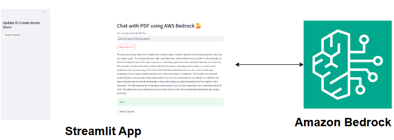

# Chat with PDF using AWS Bedrock and Streamlit

This project is an interactive web application that allows users to chat with PDF documents using Amazon Bedrock's generative AI models (Mistral and LLaMA2) and a Streamlit UI. It processes PDFs, generates embeddings with the Titan Embeddings model, stores them in a FAISS vector store, and enables question-answering based on document content. The application is built with a focus on simplicity, scalability, and leveraging AWS's serverless AI capabilities.

## Architecture



---

## Features
- **PDF Processing**: Ingests and splits PDF documents for efficient querying.
- **Vector Embeddings**: Uses Amazon Titan Embeddings for high-quality text representation.
- **Generative AI**: Integrates Mistral and LLaMA2 models from Bedrock for natural language responses.
- **Streamlit UI**: Provides an intuitive interface to ask questions and update the vector store.
- **FAISS Vector Store**: Stores document embeddings locally for fast retrieval.
- **Custom Prompting**: Ensures concise, detailed answers (minimum 250 words) based on context.

---

## Prerequisites
Before running the project, ensure you have:
- An **AWS Account** with access to Amazon Bedrock and the required models (Titan Embeddings, Mistral, LLaMA2).
- **AWS CLI** installed and configured with credentials (`aws configure`).
- **Python 3.9+** installed locally.
- A folder named `data` containing PDF files for ingestion.
- Git installed to clone the repository.

### Required Python Packages
Install dependencies via the provided `requirements.txt`:
- `boto3`
- `streamlit`
- `langchain` (with `langchain_community`)
- `faiss-cpu`
- `numpy`
- `PyPDF2` (or similar PDF loader)

---

## Installation

1. **Clone the Repository**:
   ```bash
   git clone https://github.com/yourusername/Chat-PDF-AWS-Bedrock.git
   cd Chat-PDF-AWS-Bedrock
2. **Install Dependencies:**:
    pip install -r requirements.txt
3. **Set Up AWS Credentials:**:
    Ensure your IAM role has permissions for Bedrock.
    Configure AWS CLI with your Access Key and Secret Key:
    ```bash 
    aws configure

## Usage
1. **Run the application**:
    ```bash 
    streamlit run app.py
    The app will open in your default browser (e.g., http://localhost:8501).
2. **Update Vector Store**:
    In the sidebar, click "Vectors Update" to process PDFs and create/update the FAISS index.
3. **Ask Questions:**:
    Input: "Summarize the key points of the document."
    Output: A detailed response generated by Mistral or LLaMA2, sourced from the PDFs.

## License
This project is licensed under the MIT License. See LICENSE for details.

## Contact
For questions or feedback, reach out to:

Email: marthalarajavardhanreddy@gmail.com.com
GitHub: yourusername

## Acknowledgments
Built with LangChain, Streamlit, and AWS Bedrock.
Thanks to the open-source community for tools like FAISS and PyPDF.